# Deep Learning Algorithm Flowchart

```mermaid
flowchart TD
    START(["🚀 **Start: Choose Deep Learning Algorithm**"])
    
    START --> Q1{"**What is your data type?**"}
    
    %% ── TABULAR / STRUCTURED ──
    Q1 -->|"📊 Tabular / Structured"| Q_TAB{"**Task?**"}
    Q_TAB -->|"Regression"| MLP_REG["**MLP (Multi-Layer Perceptron)**<br/>• 2-5 hidden layers<br/>• ReLU activation<br/>• MSE / MAE loss"]
    Q_TAB -->|"Classification"| MLP_CLS["**MLP Classifier**<br/>• Softmax / Sigmoid output<br/>• Cross-Entropy loss"]
    Q_TAB -->|"Anomaly Detection"| AUTOENC["**Autoencoder**<br/>• Reconstruction error<br/>• Variational AE (VAE) for generative"]
    
    %% ── IMAGE / SPATIAL ──
    Q1 -->|"🖼️ Image / Spatial"| Q_IMG{"**Task?**"}
    Q_IMG -->|"Classification"| CNN_CLS["**CNN**<br/>• ResNet, EfficientNet, ConvNeXt<br/>• Transfer Learning preferred"]
    Q_IMG -->|"Object Detection"| OBJ_DET{"**Real-time needed?**"}
    OBJ_DET -->|"Yes"| YOLO["**YOLO / SSD**<br/>• Single-shot detectors<br/>• Real-time inference"]
    OBJ_DET -->|"No (higher accuracy)"| RCNN["**Faster R-CNN / DETR**<br/>• Two-stage / Transformer-based"]
    Q_IMG -->|"Segmentation"| SEG{"**Type?**"}
    SEG -->|"Semantic"| SEMSEG["**U-Net / DeepLab**<br/>• Pixel-level class labels"]
    SEG -->|"Instance"| INSSEG["**Mask R-CNN / YOLACT**<br/>• Per-object masks"]
    Q_IMG -->|"Generation"| IMG_GEN{"**Approach?**"}
    IMG_GEN -->|"GAN-based"| GAN["**GAN**<br/>• StyleGAN (high quality)<br/>• pix2pix (image-to-image)<br/>• CycleGAN (unpaired)"]
    IMG_GEN -->|"Diffusion"| DIFF["**Diffusion Models**<br/>• Stable Diffusion<br/>• DALL·E<br/>• Imagen"]
    IMG_GEN -->|"Auto-regressive"| VAR["**VQ-VAE / VQGAN**<br/>• DALL·E (discrete tokens)"]
    
    %% ── SEQUENCE / TIME-SERIES ──
    Q1 -->|"📈 Sequence / Time-Series"| Q_SEQ{"**Task?**"}
    Q_SEQ -->|"Many-to-One (classification/regression)"| RNN1["**LSTM / GRU**<br/>• Bidirectional optional<br/>• Attention pooling"]
    Q_SEQ -->|"Many-to-Many (seq2seq)"| SEQ2SEQ{"**Length?**"}
    SEQ2SEQ -->|"Short sequences<br/>(&lt;100 steps)"| LSTM_S2S["**LSTM Seq2Seq + Attention**<br/>• Encoder-Decoder<br/>• Bahdanau / Luong attention"]
    SEQ2SEQ -->|"Long sequences<br/>or best quality"| TRANSFORMER["**Transformer**<br/>• Self-Attention<br/>• Positional Encoding<br/>• Parallel training"]
    Q_SEQ -->|"Forecasting"| FORECAST{"**Complexity?**"}
    FORECAST -->|"Simple univariate"| SIMPLE_TS["**LSTM / GRU**<br/>• Single series<br/>• Sliding window"]
    FORECAST -->|"Multi-variate / Long-range"| ADV_TS["**Transformer / Informer / PatchTST**<br/>• Channel independence<br/>• Long-sequence efficiency"]
    
    %% ── TEXT / NLP ──
    Q1 -->|"📝 Text / NLP"| Q_NLP{"**Task?**"}
    Q_NLP -->|"Classification / NER"| BERT["**BERT / RoBERTa / DeBERTa**<br/>• Encoder-only Transformer<br/>• Fine-tune on task head"]
    Q_NLP -->|"Generation / Chat"| LLM{"**Scale?**"}
    LLM -->|"Fine-tune smaller model"| GPT_SMALL["**GPT-2 / LLaMA / Mistral**<br/>• Decoder-only Transformer<br/>• LoRA / QLoRA fine-tuning"]
    LLM -->|"Prompt large model"| GPT_LARGE["**GPT-4 / Claude / Gemini**<br/>• Few-shot / Chain-of-Thought<br/>• RAG for grounding"]
    Q_NLP -->|"Translation / Summarization"| SEQ_TRANS["**T5 / BART**<br/>• Encoder-Decoder Transformer<br/>• Text-to-text framework"]
    
    %% ── GRAPH / RELATIONAL ──
    Q1 -->|"🕸️ Graph / Relational"| Q_GRAPH{"**Task?**"}
    Q_GRAPH -->|"Node Classification"| GCN["**GCN / GraphSAGE**<br/>• Message passing<br/>• Inductive learning"]
    Q_GRAPH -->|"Link Prediction"| GAE["**Graph Autoencoder / SEAL**<br/>• Encode-decode edges"]
    Q_GRAPH -->|"Graph Classification"| GIN["**GIN / DiffPool**<br/>• Readout + pooling"]
    
    %% ── AUDIO / SPEECH ──
    Q1 -->|"🔊 Audio / Speech"| Q_AUDIO{"**Task?**"}
    Q_AUDIO -->|"Speech Recognition"| ASR["**Whisper / Wav2Vec 2.0**<br/>• Transformer + CTC / Seq2Seq"]
    Q_AUDIO -->|"Speech Synthesis"| TTS["**Tacotron 2 / FastSpeech**<br/>• Text → Mel-spectrogram → Vocoder"]
    Q_AUDIO -->|"Audio Classification"| AUDIO_CLS["**CNN on spectrograms**<br/>• Or AST (Audio Spectrogram Transformer)"]
    
    %% ── REINFORCEMENT LEARNING ──
    Q1 -->|"🎮 Decision / Control (RL)"| Q_RL{"**Action space?**"}
    Q_RL -->|"Discrete"| DQN["**DQN / Rainbow**<br/>• Experience replay<br/>• Target network"]
    Q_RL -->|"Continuous"| PG["**PPO / SAC / TD3**<br/>• Policy gradient<br/>• Actor-Critic"]
    Q_RL -->|"Multi-Agent"| MARL["**MADDPG / QMIX**<br/>• Centralized training<br/>• Decentralized execution"]
    
    %% ── TRAINING STRATEGIES (cross-cutting) ──
    MLP_REG & MLP_CLS & CNN_CLS & RNN1 --> TRAINING["⚙️ **Training Considerations**"]
    TRAINING --> T1["**Optimizer:** AdamW (default)<br/>SGD + Momentum (CV tasks)"]
    TRAINING --> T2["**Regularization:** Dropout, Weight Decay,<br/>Batch/Layer Norm, Data Augmentation"]
    TRAINING --> T3["**LR Schedule:** Cosine Annealing,<br/>Warmup + Decay, OneCycle"]
    TRAINING --> T4["**Hardware:** Single GPU → Multi-GPU (DDP)<br/>→ TPU / Multi-Node (FSDP)"]
    
    %% Styling
    style START fill:#4CAF50,color:#fff,stroke:#2E7D32,stroke-width:3px
    style Q1 fill:#2196F3,color:#fff,stroke:#1565C0
    style Q_IMG fill:#FF9800,color:#fff
    style Q_SEQ fill:#FF9800,color:#fff
    style Q_NLP fill:#FF9800,color:#fff
    style Q_TAB fill:#FF9800,color:#fff
    style Q_GRAPH fill:#FF9800,color:#fff
    style Q_AUDIO fill:#FF9800,color:#fff
    style Q_RL fill:#FF9800,color:#fff
    
    style CNN_CLS fill:#9C27B0,color:#fff
    style YOLO fill:#9C27B0,color:#fff
    style RCNN fill:#9C27B0,color:#fff
    style SEMSEG fill:#9C27B0,color:#fff
    style INSSEG fill:#9C27B0,color:#fff
    style GAN fill:#E91E63,color:#fff
    style DIFF fill:#E91E63,color:#fff
    style VAR fill:#E91E63,color:#fff
    
    style RNN1 fill:#00BCD4,color:#000
    style LSTM_S2S fill:#00BCD4,color:#000
    style TRANSFORMER fill:#00BCD4,color:#000
    
    style BERT fill:#795548,color:#fff
    style GPT_SMALL fill:#795548,color:#fff
    style GPT_LARGE fill:#795548,color:#fff
    style SEQ_TRANS fill:#795548,color:#fff
    
    style TRAINING fill:#607D8B,color:#fff,stroke:#37474F
```



## Quick Reference Table

| Data Type | Task | Recommended Architecture |
|---|---|---|
| Tabular | Regression / Classification | MLP, TabNet |
| Image | Classification | CNN (ResNet, EfficientNet) |
| Image | Detection | YOLO, Faster R-CNN, DETR |
| Image | Segmentation | U-Net, Mask R-CNN |
| Image | Generation | Stable Diffusion, GAN |
| Text | Understanding | BERT, RoBERTa |
| Text | Generation | GPT, LLaMA, Claude |
| Text | Translation | T5, BART |
| Sequence | Time-Series | LSTM, Transformer, PatchTST |
| Graph | Node/Link | GCN, GraphSAGE |
| Audio | Speech-to-Text | Whisper, Wav2Vec |
| Control | RL | PPO, SAC, DQN |

## Key Architectural Families

```
Deep Learning
├── Feedforward (MLP)
│   └── Universal function approximators
├── Convolutional (CNN)
│   ├── 2D CNN → Images
│   ├── 3D CNN → Video / Volumetric
│   └── 1D CNN → Audio / Sequences
├── Recurrent (RNN)
│   ├── LSTM → Long-term dependencies
│   └── GRU → Computationally lighter
├── Transformer
│   ├── Encoder-only → Understanding (BERT)
│   ├── Decoder-only → Generation (GPT)
│   └── Encoder-Decoder → Seq2Seq (T5)
├── Generative
│   ├── GAN → Adversarial training
│   ├── VAE → Latent variable models
│   ├── Diffusion → Iterative denoising
│   └── Autoregressive → Token-by-token
├── Graph Neural Networks
│   ├── Spectral → GCN, ChebNet
│   └── Spatial → GraphSAGE, GAT
└── Reinforcement Learning
    ├── Value-based → DQN
    ├── Policy-based → PPO, TRPO
    └── Actor-Critic → A2C, SAC
```

> **View this flowchart:** Paste the Mermaid code into [mermaid.live](https://mermaid.live) or open in any Mermaid-compatible viewer (GitHub, VS Code, Notion).
