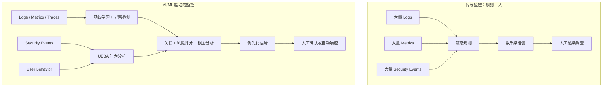
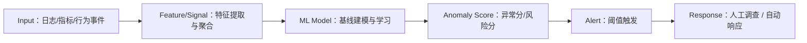
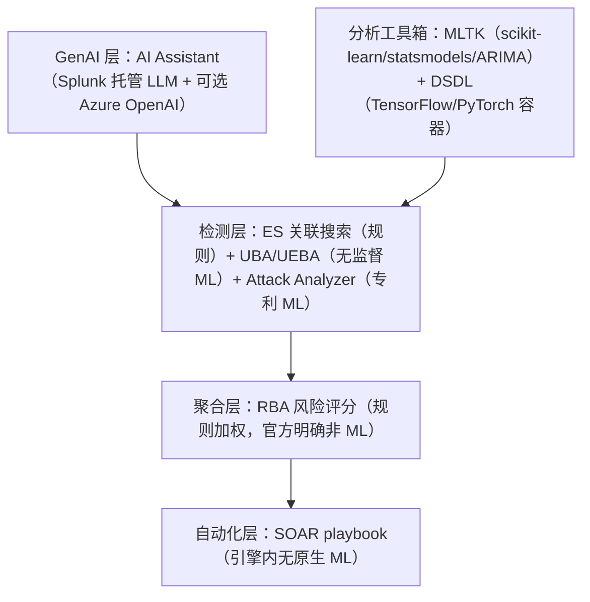
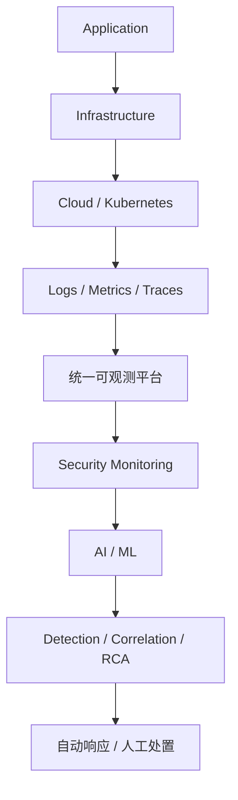
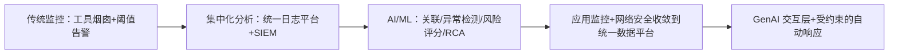

# AI / ML in Cybersecurity & Application Monitoring
## Enterprise Use Cases, Platforms and Case Studies

> 调研日期：2026-09-24 ｜ 语言：中文（技术术语保留英文）
> 证据基础：64 个已验证企业案例（`case-study-matrix.csv`）、170 条分级来源（`sources.md`）、5 个并行研究 agent + 独立事实核查
> 证据分级：①厂商官方文档/官方案例 ②厂商工程博客/新闻稿/专利 ③第三方研究（Gartner/Forrester/IDC、媒体）④学术论文
> 约定：凡无公开技术证据的 AI 声明，一律标注 **No publicly available evidence found**；凡无可量化数据的案例，一律标注 **Quantitative impact not publicly disclosed**；凡厂商自报数字，标注 ⚠ 并注明口径。

---

## Executive Summary

（完整版见 `executive-summary.md`）

本报告回答一个核心问题：**Splunk、AI/ML/DL 以及同类监控平台，在真实企业的 Cybersecurity Service 和 Application Monitoring 中到底是怎么用的？**

三个最重要的结论：

1. **AI 的真实价值是"降噪 + 加速定位"，不是"发现更多问题"**。案例证据显示，企业的收益几乎全部表现为：告警量/工单量下降（Kroger -99%、Hexaware 误报 -96%）、MTTR/MTTD 下降（BT MTTI -90%、Lenovo 30→<5 分钟、Konecta -90%）、人力释放（St. Luke's 月省 200 小时）。
2. **主流平台的"AI"主体是统计方法 + 经典 ML**。深度学习只在少数位置真实落地（CrowdStrike 云 ML、Datadog Toto、Splunk DSDL 容器），强化学习无任何厂商生产证据；LLM/GenAI 是 2023 年后的新交互层，不替代检测引擎。
3. **2025–2026 正在发生平台洗牌**：Splunk UBA 独立产品 2027-01-31 EOL（并入 ES Premier）；Sentinel Azure 门户 2027-03-31 退役；QRadar SaaS 已停止销售并分批 EOL（迁移向 Cortex XSIAM）；AppDynamics 更名 Splunk AppDynamics。任何选型结论必须基于 2026 年现状。

---

## 1. 研究范围与方法论

### 1.1 范围

- **研究问题**（源自研究需求文档）：企业为什么使用这些平台？AI/ML 具体做了什么？解决了传统监控无法解决的什么问题？真实案例与效果？哪些场景不需要 AI？为什么已有传统 SIEM/监控还需要 AI-driven monitoring？Splunk 与竞品的 AI/ML 差异？
- **平台覆盖**：Splunk（核心，安全+可观测全产品线）、Dynatrace、Datadog、New Relic、Splunk AppDynamics、Elastic、Grafana Labs、Sumo Logic、Azure Monitor、GCP Cloud Operations、Microsoft Sentinel、Google SecOps、CrowdStrike、Palo Alto Cortex XSIAM、IBM QRadar，以及补充平台（SentinelOne、Securonix、Gurucul、Anvilogic、Panther、BigPanda、Moogsoft）。
- **案例覆盖**：64 个已验证案例，跨 9 大行业（金融 9、科技/SaaS 10、零售/电商 8、政府/公共 7、医疗 5、制造 5、电信 4、体育/娱乐 3、其他 13），安全 41%、APM 38%、安全+可观测收敛 21%。

### 1.2 方法

按研究需求采用 **iterative research** 六阶段：

| 阶段 | 内容 | 产出 |
|---|---|---|
| Phase 1 Landscape Discovery | 8+ 组主题检索 | 平台全景与 AI 声明地图 |
| Phase 2 Vendor Deep Dive | 5 个并行研究 agent 分平台深挖 | 每平台机制+证据表（research/ 目录） |
| Phase 3 Case Study Discovery | 官方 customer story 页面逐一核验 | 64 案例矩阵（case-study-matrix.csv） |
| Phase 4 Technical Validation | 逐条核对 ML/DL/LLM 声明 vs 公开技术证据 | 技术-证据表（第 4 章） |
| Phase 5 Cross-analysis | 跨平台归类、收敛案例提炼 | 第 9–10 章 |
| Phase 6 Report Generation | 本报告 + 3 个附属文件 | report/CSV/sources/exec-summary |

### 1.3 证据纪律

- 每个关键事实都有 URL + 日期；关键 URL 由 agent 直接抓取核验（合计 60+ 个），本会话另对最重磅声明（Splunk UBA EOL、QRadar 收购时间线）做了独立二次核验。
- **"AI-powered" ≠ "Deep Learning"**：本报告严格区分厂商营销语言与可查证的技术机制。
- 来源冲突时并列呈现（如 "Source A claims X, while Source B reports Y"），不自行裁决。
- 被剔除的无法验证案例：Notre Dame、STChealth、Petrofac、DICK'S、Otis、Heineken、Verily、CarMax、Truist、Telstra、LifeLabs 等（详见 research/ 各 agent 文件的剔除记录）。

---

## 2. 传统监控解决不了的问题

传统监控（阈值告警、工具烟囱、人工调查）的失败模式，在 64 个案例中反复出现：

| 失败模式 | 案例证据 |
|---|---|
| **告警洪泛**：静态阈值要么漏报要么海量误报 | Konecta"告警疲劳"；Johnson Matthey SOC"大海捞针"；Kroger 新应用上线后 700 工单/周；Louisiana 全人工处理告警 |
| **工具烟囱**：多个监控 agent/工具互相看不见 | Kroger 16 个监控 agent；BT Digital 16 套工具、检测滞后 30 分钟；Skyscanner 12+ 工具 |
| **根因定位靠人工**：延迟升高时无法自动判断是代码/DB/网络/K8s/云的问题 | Domino's SRE 靠 grep 查日志；Lenovo 电商故障定位慢（MTTR 30 分钟）；CBTS MTTR 以天计 |
| **规则跟不上变化**：规则只能检测"已知的已知" | 规则式 SIEM 对慢速攻击、内部威胁、无签名攻击失效（Uber 自建 SIEM 的动因；Heartland Jiffy Lube 依赖手工流程） |
| **行为盲区**：传统 SIEM 看事件，不看"谁的行为偏离了自己的常态" | Heartland Jiffy Lube（UBA 解决）；Splunk UBA/Elastic ML jobs 的存在理由 |
| **没有基线**：不知道"正常"是什么，就无法可靠地说"异常" | 所有自适应阈值/异常检测产品的共同前提（ITSI、Watchdog、Davis） |

**根因**：传统监控 = 规则 + 人。规则只能编码已知模式；人的带宽决定了告警必须被压缩到"人能看完"的量级——这两个约束在数据量增长面前必然失效。

---

## 3. AI/ML 如何改变监控

### 3.1 范式对比

### 3.2 异常检测的通用管线

几乎所有平台的"AI 检测"都遵循同一条管线，差异在每层的实现：

各平台的实现对照（公开技术证据）：

| 层 | Splunk | Dynatrace | Datadog | Sentinel | Elastic | CrowdStrike |
|---|---|---|---|---|---|---|
| 特征 | 事件聚合+字段统计（MLTK fit 前 one-hot 等） | OneAgent 全栈遥测+Smartscape 拓扑实体 | 指标分桶+tag 维度 | 实体行为属性+时间窗（10–180 天） | bucket 聚合+detector function | 文件特征向量（数千数值） |
| 模型 | UBA 无监督基线；ITSI 统计阈值（标准差/分位数） | 确定性因果（fault-tree 遍历拓扑，**非统计 ML**） | 专利三算法（basic/agile/robust，类 SARIMA+季节分解） | UEBA 基线+peer group（TF-IDF）；Fusion ML 关联（30 天训练） | 聚类/贝叶斯/时间序列分解概率模型 | 云端 ML 分类（架构未公开） |
| 评分 | anomaly→threat 串链 | problem 根因排序 | anomaly score+dimensional analysis | InvestigationPriority 0–10 / AnomalyScore 0–1 | anomaly score 0–100 | 置信度 |
| 响应 | SOAR playbook | Davis CoPilot 建议/自动修复工作流 | Bits AI 调查 | Security Copilot/Fusion 自动合并 incident | AI Assistant/Attack Discovery | Charlotte AI/ Fusion SOAR |

---

## 4. AI/ML 技术全景：营销 vs 技术现实

### 4.1 全平台技术-证据矩阵

（Y=有公开技术证据；U=营销声称但无技术细节；N=无证据。来源编号见 sources.md）

| 技术 | Splunk | Dynatrace | Datadog | New Relic | Sentinel | Google SecOps | CrowdStrike | XSIAM | Elastic | Azure Monitor | Sumo Logic |
|---|---|---|---|---|---|---|---|---|---|---|---|
| 规则检测 | Y | Y | Y | Y | Y | Y | Y | Y | Y | Y | Y |
| 统计方法 | Y（ITSI 自适应阈值） | U | Y（专利：SARIMA/季节分解） | Y（标准差+季节） | Y（UEBA 分数制） | U | Y | U | Y（概率模型） | Y（20min 窗口+Xσ） | U |
| 经典 ML | Y（MLTK scikit-learn 80+/300+ 算法） | Y（算法未公开） | Y | U（专利级） | Y（UEBA/Fusion） | U | Y（云端 ML） | Y（detector 基线） | Y（聚类/贝叶斯） | Y（失败聚类） | U |
| 深度学习 | 可选（DSDL 容器，用户自建） | N（明示确定性因果） | Y（Toto 开源权重，生产集成未确认） | N | N | U | Y（云 ML 架构未公开；IOA 用 DL 提取 PowerShell 代码段） | U | N（BERT 仅用于 NLP 任务，非日志异常检测） | N | N |
| NLP | Y（AI Assistant 语义检索） | Y（CoPilot NL→DQL） | Y（Bits AI） | Y（Grok 50+ 语言） | Y（UEBA behaviors 层 NL 解释） | Y（Gemini NL→YARA-L） | Y（Charlotte AI） | U | Y（categorization 明示"非 NLP"；ESRE 语义检索） | N | Y（Mo/Mobot） |
| LLM | Y（Splunk 托管 LLM 未公开基座；可选 Azure OpenAI；安全侧 Foundation-Sec-8B-1.1） | Y（CoPilot，模型未公开） | Y（Bits：初版 OpenAI，现 model-agnostic） | Y（Grok：OpenAI） | Y（Security Copilot：GPT-4→GPT-4.1） | Y（Gemini，具体版本未公开；VT 用 Sec-PaLM） | Y（Charlotte：Bedrock 多模型；AgentWorks 引入 Claude/GPT/Nemotron） | Y（Copilot，模型未公开） | Y（连接器模式：OpenAI/Azure/Bedrock/Vertex/自托管） | N（Copilot 在 Azure 层） | Y（Mo：Bedrock，最终模型未公开） |
| 生成式 AI | Y | Y | Y | Y | Y | Y | Y | Y | Y | N | Y |
| 强化学习 | N | N | N | N | N | N | N | N | N | N | N |

### 4.2 深度学习：真相核查

研究需求特别要求不要默认"AI = Deep Learning"。结论：

| 位置 | 状态 | 证据 |
|---|---|---|
| 学术 DL 日志异常检测（DeepLog 2017 / LogAnomaly 2019 / LogBERT 2021 / LogRobust 2019） | **研究阶段，无任何厂商公开部署证据** | 各论文页面；2022 综述指出真实场景泛化性问题 |
| CrowdStrike 云端 ML | 生产中（特征向量云推断 50 万/秒、10TB/秒），网络架构未公开；IOA 明确披露"deep learning models 自动提取 PowerShell 代码段" | CrowdStrike 工程博客 2022 |
| Datadog Toto | 151M 参数 transformer 时间序列基础模型，2025 开源权重；**与 Watchdog 生产集成无公开确认**（第三方 2025-11 称"尚未部署到生产"） | Datadog 官方博客 + 第三方冲突信息 |
| Splunk DSDL（原 DLTK） | TensorFlow/PyTorch 容器，**未弃用**（v5.2.4，2026-05-22），但模型需用户自建 | Splunkbase |
| Elastic | BERT 类 transformer 用于 NLP 推理（情感/向量检索），**不是**用于日志异常检测（categorization 明示为非 NLP 聚类） | Elastic 官方文档 |
| Splunk UBA 误报抑制 | 官方博客称"自监督深度学习算法"对 anomaly 向量化排序 | Splunk 安全博客 |
| 强化学习 | **所有主流厂商：No publicly available evidence found**（仅学术基准研究） | 全平台检索 |

### 4.3 GenAI 助手盘点（2023–2026）

| 产品 | 宣布/GA | 底层 LLM（公开证据） | 定位 |
|---|---|---|---|
| Microsoft Security Copilot | 2023-03（GA 2024-04） | GPT-4 起步，2025-07 起 GPT-4.1 GA | 事件摘要/狩猎/报告/自主 agent（Phishing Triage、Security Analyst Agent 2026-04） |
| New Relic Grok | 2023-05 | OpenAI | 首个可观测性 GenAI 助手 |
| Elastic AI Assistant | 2023-06 | 连接器模式（OpenAI/Azure OpenAI 起步；现加 Bedrock/Vertex/自托管；默认 Elastic Managed LLM GA 2025-11） | 告警摘要/查询生成/Attack Discovery |
| Datadog Bits AI | 2023-08 | 初版 OpenAI；现行 model-agnostic 不披露 | Bits Chat/Investigation（SRE agent GA 2025-12）/Code |
| Google Gemini in SecOps | Duet AI GA 2023-12 | Gemini（具体版本未公开；TI 场景用过 1.5 Pro） | NL→YARA-L/调查/规则生成/Alert Triage Agent（预览 2025-11） |
| CrowdStrike Charlotte AI | 2023-09（Detection Triage GA 2025-02） | Amazon Bedrock 多模型；AgentWorks 引入 Claude/GPT/Nemotron | 分诊（98% 准确率 ⚠，与自家 Falcon Complete 判定对齐）/调查摘要/工作流 |
| Splunk AI Assistant | 初版 2023，v1.4 Agentic 2025-11 | Splunk 托管 LLM（基座未公开）+ 可选 Azure OpenAI；安全侧 Foundation-Sec-8B-1.1-Instruct | NL↔SPL/摘要/Agent Mode（不自动执行） |
| Dynatrace Davis CoPilot→Assist | 2023-07 宣布（GA 2024-10） | LLM 未公开 | NL→DQL/仪表盘/工作流代码 |
| SentinelOne Purple AI | GA 2024-04 | Bedrock 多模型可选（Claude 3.5 Sonnet）+ 自研 Ultraviolet 家族 | 威胁狩猎 |
| Sumo Logic Mo | GA 2024-12-02 | Amazon Bedrock（bakeoff 候选：Claude Instant/2.1、GPT-4.1 Turbo；**最终模型未公开**） | NL→Sumo 查询/Insight 摘要（Dojo AI 体系） |

---

## 5. Splunk 深度剖析（本次研究核心）

### 5.1 公司状态（2024–2026）

- **2024-03-18**：Cisco 以约 280 亿美元完成对 Splunk 的收购（Cisco 史上最大交易），品牌保留，Cisco 自身可观测性研发（含 AppDynamics）并入 Splunk 单元。
- **2024-11**：AppDynamics 更名 **Splunk AppDynamics**（未被剥离/出售，产品仍活跃）。
- **2025-09-09（.conf25）**：发布 **ES 8.2 Essentials**（ES + AI Assistant + Detection Studio）与 **Premier**（+SOAR+UEBA）两个版本；宣布 **Time Series Foundation Model（TSFM）** 2025-11 开源；2026 路线图含 Triage Agent、Malware Reversal Agent、AI Playbook Authoring 等 agentic AI。
- **重大变更：Splunk UBA 独立产品 2027-01-31 EOL**（EOS 2025-12-12），能力并入 ES Premier 原生 UEBA（`DA-ESS-UEBA`）与云交付行为分析服务（仅 ES Premier + US East + <4TB）。

### 5.2 安全侧：AI/ML 的分层结构

**逐层要点（全部有官方文档证据）：**

1. **规则层 — ES correlation search**：SPL 确定性检测，MITRE ATT&CK 内容库 + Detection Studio（8.2+ 含 GenAI 生成个性化检测）。
2. **统计加权层 — RBA（Risk-Based Alerting）**：四步流程（风险规则→risk index 聚合→风险事件规则→risk notable/findings）。**重要事实核查**：RBA 的"风险分"是规则式累加/乘数，官方文档**没有任何 ML 声明**；厂商称可降告警量 50–90% ⚠。
3. **无监督 ML 层 — UBA / ES Premier UEBA**：为每个身份/资产建立行为基线；流式模型（Kafka/K8s/Redis）+ 批处理模型（Spark+HDFS，24h 窗口）；四类 peer groups；anomaly 串链为 threat。ES 7.0 行为分析文档披露使用**多分类深度神经网络分类器 + 聚类**。另有自监督 DL 误报抑制（向量化 + 相似度排序 + 每日增量学习）。
4. **自动化层 — SOAR（原 Phantom）**：playbook 为确定性自动化；**playbook 引擎内无原生 ML（No publicly available evidence found）**；AI 以周边形态存在（Mission Guidance 建议、AI Playbook Authoring 2026）。
5. **GenAI 层 — AI Assistant**：Splunk 微调的开源 transformer LLM（**基座未公开**），托管于 Splunk Cloud AI Service，客户数据不出第三方边界；v1.4（2025-11）起可选 Azure OpenAI（此时 prompt 出边界）；Agent Mode 多步推理但**不自动执行搜索**（"thinks with you, not for you"）。安全侧摘要模型为 Cisco 自研 **Foundation-Sec-8B-1.1-Instruct**（前身 Llama-3.1-70B）。
6. **工具箱 — MLTK/AITK + DSDL**：MLTK 打包 80+ scikit-learn 算法（fit/apply 范式、partial_fit 增量学习），PSC 扩展 300+ 开源算法（statsmodels/ARIMA），5.4+ 支持 ONNX 上传；DSDL（原 DLTK，**未弃用**，v5.2.4 2026-05-22）提供 TensorFlow/PyTorch Docker 容器，用户自建 DL 模型。
7. **Attack Analyzer（原 TwinWave）**：钓鱼/恶意软件攻击链自动分析（0–100 评分 + verdict）；**专利级证据**：网页截图经 autoencoder 生成潜在表示 + 品牌分类 + allow/deny 名单识别仿冒登录页。

### 5.3 可观测侧：ITSI 与 Observability Cloud

- **ITSI 自适应阈值（直接文档证据）**：四种算法 = **标准差、分位数、区间（range-based）、百分比**；每晚基于前 7 天训练窗口按时间桶重算；4.17 起 Outlier Exclusion 与 ML-Assisted Thresholding；4.19+ entity 级自适应阈值；另有 KPI Drift Detection。**"ITSI 用 Kalman filter"属无证据传闻——文档算法列表中没有卡尔曼滤波。** 旧版异常检测（trend 算法 + entity cohesion 算法，非深度模型）已在 4.20 弃用。
- **Event iQ**：notable events 聚类为 episodes（分组策略含字段匹配、语义相似度 85%、Jaro-Winkler 90%、Token Cosine）+ 2025 年新增 GenAI Episode Summarization。
- **Observability Cloud（SignalFx 血统）**：APM 无采样全量 trace + Tag Spotlight（按 span tag 维度聚合 p50/p90/p99 定位坏版本/坏主机）；Infrastructure Monitoring 的 AutoDetect 用 ML 自动部署探测器；**AI 排障代理**（2026-02 文档）：告警自动触发根因分析，输出摘要、可疑根因+证据（日志/exemplar traces）、AI remediation plan（假设→步骤→可复制 kubectl 命令）。
- **诚实的结论**：ITSI 的"ML"主体是**统计型自适应阈值 + 事件聚类**，模型复杂度低于 UBA；Splunk APM 的"AI 排障"内部算法**无公开技术文档**（营销级描述）。

### 5.4 Splunk 案例要点（14 个已验证）

| 公司 | 场景 | 结果（厂商口径 ⚠） |
|---|---|---|
| Johnson Matthey | ES+RBA+SOAR+Attack Analyzer | 调查 30→5 分钟（-83%）、告警保真度 +30%、61% 钓鱼全自动关闭、准确率 50%→80% |
| Splunk 自身 SOC | SOAR+Attack Analyzer | 钓鱼处置快 90%、关键场景 MTTD<7 分钟 |
| Cisco IT | ITSI+Obs+自研 AI agent | 重大事故 18 个月 -25%、连续 6 季度零重大中断（可观测成本 -86% 仅见媒体转述 ⚠） |
| Lenovo | Observability Cloud（替换 Dynatrace） | MTTR 30→<5 分钟、+300% 流量下 100% 在线 |
| Honda Manufacturing | 预测性维护 ML | MTTR +70%、停产次数下降 |
| Heartland Jiffy Lube | ES+UBA | MTTR +60%、SIEM 成本 < 原方案一半 |
| TransUnion | ITSI+MLTK | 根因小时→分钟（数值未公开） |
| Carnival | ES+ITSI（收敛型） | MTTR 最高 -98%（上限口径 ⚠） |
| 其他（无 ML 或未公开数值） | John Lewis、Domino's、Zillow、LA、McLaren、Fannie Mae、ARI 医疗 | 见案例矩阵 |

**对 Splunk 的诚实评价**：
- 优势：数据平台通用性 + 分层 AI（规则/统计/ML/GenAI 每层可独立采购与审计）+ RBA/UBA 的组合被大量 SOC 验证。
- 短板：ITSI 的"ML"相对朴素（统计阈值）；多个 AI 组件（AI Assistant 基座、Attack Analyzer 内部机制）黑盒；案例几乎全部为厂商发布且多数无绝对数值。
- 对你现有 ITSI/ES 项目的直接启示见附录 A。

---

## 6. 网络安全用例（Cybersecurity Use Cases）

### 6.1 场景地图

| 场景 | 主流技术路径 | 代表平台/案例 |
|---|---|---|
| 威胁检测（已知模式） | 规则（correlation search / KQL / YARA-L / EQL） | 全部平台；这是 SIEM 的基线能力 |
| 无签名攻击/未知威胁 | 无监督 ML 行为基线（UEBA） | Splunk UBA→ES Premier UEBA；Elastic 100+ 预置 ML jobs；Sentinel UEBA；Securonix/Gurucul |
| 多阶段攻击关联 | ML 关联引擎 | Sentinel Fusion（30 天训练、50 亿告警→25 incident/月 ⚠）；Splunk UBA threat 串链；XSIAM 预置关联模型 |
| 钓鱼/恶意软件分析 | 专利 ML + GenAI 分诊 | Splunk Attack Analyzer；Charlotte AI Detection Triage；Security Alert Triage Agent |
| 内部威胁/失陷账户 | UEBA + peer group 分析 | Heartland Jiffy Lube（ES+UBA）；Sentinel UEBA（TF-IDF peer groups）；TAMUS（Elastic） |
| 告警分诊与调查加速 | LLM | St. Luke's（月省 200 小时）；Charlotte AI（40+ 小时/周 ⚠）；Gemini Alert Triage Agent（30 分钟→约 60 秒 ⚠，Google 产品口径） |
| SOC 自动化/响应 | SOAR playbook（确定性为主） | Louisiana 86% 自动解决；Konecta 4 个月 70% 自动化；Johnson Matthey 61% 自动关闭 |
| 威胁情报 | 规则匹配（IOC）+ ML 优先级 | Sentinel TI-map（规则）；Chronicle Applied Threat Intelligence（ML 优先级）；Splunk TruSTAR（**其独立 ML 机制无公开证据**） |

### 6.2 规则 vs ML vs LLM 的分工（重要概念）

以三个平台为例说明三层如何协作：

| 平台 | 规则层 | ML 层 | LLM 层 |
|---|---|---|---|
| Splunk | ES correlation search（人工编写 SPL） | UBA/UEBA 行为基线；Attack Analyzer（专利 ML） | AI Assistant 摘要/SPL 生成（不自动执行） |
| Sentinel | KQL scheduled rules + TI-map | UEBA（TF-IDF peer groups）+ Fusion（30 天训练） | Security Copilot（GPT-4→4.1）：摘要/KQL 翻译/自主分诊 agent |
| Elastic | KQL/EQL 检测规则 | 预置 ML jobs（聚类/贝叶斯，anomaly score 阈值告警） | AI Assistant + Attack Discovery（LLM 把告警归并为攻击叙事，2024-05 RSA 发布） |

**结论：LLM 不替代检测引擎。** 所有已验证案例中，LLM 的收益是"调查/报告/分诊提速"，检测精度仍取决于规则+ML 层。这也是"bounded autonomy"（受约束自主）成为 CrowdStrike Charlotte AI 设计原则的原因。

---

## 7. 应用监控 / APM 用例

### 7.1 关键问题：延迟升高时，平台如何判定根因？

研究需求特别要求回答：**当 application latency 上升时，平台如何判断是 application、database、network、container/K8s、cloud infrastructure 还是 external dependency 的问题？**

| 平台 | 机制 | 代码/DB/网络/K8s/云/外部依赖的区分方式 | 证据强度 |
|---|---|---|---|
| Dynatrace Davis | **确定性因果推理**：在 Smartscape 实时拓扑上做 fault-tree 分析，沿真实依赖边回溯"最早恶化的实体"；事件合并/去重为可审计规则（5 分钟窗口、90 分钟封顶、duplicate 标记） | 拓扑实体覆盖 DB 调用（PurePath 记录每个 SQL）、主机/K8s workload、云集成；根因输出含"根因服务所在进程/主机/K8s workload" | 强（官方文档+培训材料+独立分析师；合并规则公开） |
| Datadog Watchdog | **统计异常 + 状态变更分类**：RCA 明确"从不把延迟/错误本身当根因"——根因限定为四类离散状态变更：①版本部署变更 ②流量突增 ③AWS 实例故障 ④磁盘耗尽；再加 faulty K8s deployment 检测与第三方 API 降级检测 | 部署→代码；实例/磁盘→基础设施；流量→外部；DB 依赖经 service map/traces 定位 | 强（官方文档+专利；内部关联算法未公开） |
| New Relic | 追踪 + 基线/离群异常（DBSCAN）+ AI 辅助解释（Grok） | 依赖 tracing dependency 数据+基础设施 agent；Errors Inbox 定位代码级错误；**无公开因果引擎** | 中 |
| Splunk APM | Service Map + Tag Spotlight（对已索引 span tags 按值聚合 p50/p90/p99，隔离坏版本/坏主机）+ DB query monitoring + Profiling | 官方 Lantern 实操案例：checkout 延迟→service map 定位 paymentservice→Tag Spotlight 显示错误全部集中在版本 v350.10→回滚 | 中（机制可查；"AI 排障"内部算法无公开文档） |
| Elastic | ML 关联延迟/错误/故障 + service map 标识异常慢响应 | 日志归类+速率分析+异常检测任务组合 | 中 |
| Azure Monitor | Smart Detection：失败率 20 分钟窗口 vs 过去 40 分钟/7 天，超 Xσ 触发，再对失败请求做**聚类分析**找特征模式 | 依赖失败关联（dependency failures）；Change Analysis 关联资源变更 | 中（机制文档详实） |
| GCP | Gemini Cloud Assist Investigations：从 logs/configs/metrics 生成可验证 Observations，输出多个可能根因假设 | 依赖资源图+领域知识综合 | 中 |

### 7.2 案例要点（13 个已验证，另有 2 个二手口径）

| 公司 | 平台 | 结果（⚠ 均为厂商口径） |
|---|---|---|
| BT Digital | Dynatrace | 16 工具→1、MTTI 最高 -90%、检测滞后 30 分钟→实时、2027 前累计省 £28m、EE 数字事故年同比 -50% |
| Air Canada | Dynatrace | MTTR -55% |
| SAP CX | Dynatrace | MTTR 最高 -50% |
| Kroger | Dynatrace | 工单 700→7/周（-99%） |
| Samsung Electronics | Datadog | 自建 AIOps Agent（Watchdog+MCP+Bedrock）：区域故障根因约 1 分钟 |
| Peloton | Datadog | 30 天 12 个 endpoint 响应快 3 倍+（tracing 暴露单请求数百次 DB 调用） |
| Mercado Libre | Datadog | 黑五 100% 可用、吸收 20–40% 峰值 |
| Chegg | New Relic | MTTR 197→24 分钟（-87%） |
| AB InBev | New Relic | MTTR -80%、定价引擎 8s→100ms |
| Skyscanner | New Relic | 遥测成本 -90%+、替代 12+ 工具 |
| Hexaware | Elastic | 误报 -96%、AI Assistant 效率 +50% |
| PepsiCo | Elastic | MTTR -30% |
| Telefónica Germany | Elastic | RCA 时间 -80%（Elastic 引 Gartner MQ 口径 ⚠） |
| iFood / Energisa | Datadog Bits AI SRE | MTTR -70% / 根因<4 分钟（**二手报告口径，谨慎引用**） |

---

## 8. AIOps 与根因分析

### 8.1 告警关联/去重/降噪的公开机制

| 平台 | 实际机制（有文档证据） |
|---|---|
| Dynatrace Davis | 确定性合并规则（5 分钟窗口/90 分钟封顶/duplicate 标记）+ 拓扑根因排序，数十万事件→4–5 incident/天 ⚠ |
| Splunk ITSI | NEAP 分组（字段匹配/语义相似度 85%/Jaro-Winkler 90%/Token Cosine）+ Event iQ ML 分组建议 |
| Datadog | Watchdog 维度分析（定位贡献异常的 tag 组合）+ 变更关联（部署/流量） |
| Azure Monitor | Smart Groups（ML 合并相关告警） |
| Sumo Logic | 自适应 Signal clustering → Insight Engine（对齐 MITRE） |
| BigPanda | **规则驱动**（correlation patterns=source+tags+时间窗），"Open Box ML"为营销词 |
| Moogsoft | Cookbook 确定性聚类 + 文本相似度（bag-of-words+shingling/Sørensen–Dice），"NLP 相似度而非 AI ML" |

### 8.2 公开的告警减少数字（⚠ 全部为厂商自报/厂商委托，无独立审计）

| 来源 | 数字 |
|---|---|
| Splunk RBA 特性页 | 告警量下降 50–90% |
| Splunk ITSI 产品页 | 降噪 95%、MTTR 90%；Leidos 98%（3,500→50 事件/天）；Econocom 10x 事件减少/-60% |
| Dynatrace 官方博客 | 过滤 >99.9% 噪声、MTTR -56% |
| Sentinel Fusion 数据表 | 单月 500 亿异常告警→25 个可行动 incident |
| XSIAM 营销页 | SmartGrouping 降 75% 告警；AgentiX MTTR -98%/人工 -75% |
| BigPanda 电子书 | 自动关联最多 99% 告警 |
| Panther（Claude/Bedrock） | 告警量最高 -70%、triage 最高提速 60% |

**解读**：这些数字方向一致（降噪 50–99%），但因均为厂商口径且口径不一（告警、事件、工单、incident 混用），**不能横向比较**。案例库中与"告警量"最接近的独立描述是 Kroger 的"700→7 工单/周"与 Hexaware"误报 -96%"——但同样出自厂商案例。

### 8.3 失败预测与容量规划（有公开机制的少数）

- Elastic：预测分析（磁盘/负载预测+置信区间）文档明确。
- GCP：forecastHorizon 预测型告警（训练=2×预测窗口、持续学习至 6×）。
- Datadog：专利级预测技术 + Toto 开源权重（生产集成未确认）。
- 其余平台：**No publicly available evidence found**（含 Splunk ITSI 的"预测性分析"多停留在营销层）。

---

## 9. 安全 + 可观测性收敛（Convergence）

研究需求特别要求寻找"同一企业把应用监控、基础设施监控和网络安全监控放到同一个 telemetry/analytics 平台"的案例。找到 **6 个收敛型案例**（占案例库 21%）：

| 企业 | 平台 | 收敛方式 | 结果 |
|---|---|---|---|
| Carnival | Splunk（ES+ITSI） | 船队应用/基础设施+安全告警同一平台 | MTTR 最高 -98% ⚠ |
| Fannie Mae | Splunk（ES+ITSI+APM） | 安全日志+合规日志+应用遥测统一 | 更快 MTTR（定性，无数字） |
| Cisco IT | Splunk（ITSI+Obs+AppDynamics+ThousandEyes） | 自研 AI agent 跨安全/网络/应用做根因摘要 | 重大事故 -25%、零重大中断 |
| Arc XP | Datadog（Cloud SIEM+Flex Logs） | 安全+可观测统一关联 | 人工工作流 -20%、工程师周省 2–4 小时 |
| OpenPayd | Sumo Logic（SIEM+Observability） | 多云安全+应用单平台 | MTTD/MTTR 各 -80% |
| Standard Chartered nexus | Sumo Logic | 安全+DevOps+业务指标单平台（对比 Datadog/Splunk 后选型） | 5 个月 10 项流程改进 |
| Informatica | Elastic | DB/网络/K8s 可观测+安全成本合一 | 成本 -50% |

**收敛的架构模式**：

**趋势判断**：Splunk（Cisco）、Datadog（Cloud SIEM）、Elastic（Security+Observability 一体）、Sumo Logic 都在把安全与可观测并入同一数据平台；Microsoft 走的是"Defender 门户统一 Sentinel+XDR"的收敛路径。但案例证据同时显示：**收敛的主要收益是关联能力与成本，安全与可观测的检测引擎仍然分层**。

---

## 10. 平台对比

### 10.1 能力矩阵

| 能力 | Splunk | Dynatrace | Datadog | New Relic | Sentinel | Google SecOps | CrowdStrike | Cortex XSIAM | Elastic |
|---|---|---|---|---|---|---|---|---|---|
| Log Analytics | ★★★ 核心 | ★★（Grail） | ★★ | ★★ | ★★ | ★★ | — | ★★ | ★★ |
| Metrics | ★★（Obs Cloud） | ★★ | ★★★ | ★★ | — | ★ | — | — | ★★ |
| Traces/APM | ★★（无采样） | ★★★ | ★★★ | ★★★ | — | — | — | — | ★★ |
| SIEM | ★★★ | — | ★★（Cloud SIEM） | — | ★★★ | ★★★ | ★（NG-SIEM） | ★★★ | ★★★ |
| SOAR | ★★★ | — | ★ | — | ★★（+Logic Apps） | ★★ | ★（Fusion） | ★★★ | ★（workflows） |
| UEBA | ★★★（ES Premier） | — | ★ | — | ★★★ | ★★ | ★★（ITP） | ★★ | ★★ |
| 异常检测 | ★★（ITSI 统计） | ★★（Davis 因果） | ★★★（Watchdog） | ★★ | ★★ | ★★ | ★★ | ★★ | ★★★（100+ jobs） |
| 经典 ML 开放度 | ★★★（MLTK 300+ 算法） | ★（黑盒） | ★★（专利公开） | ★ | ★ | ★ | ★ | ★（BYOML） | ★★★（聚类/贝叶斯+PyTorch 导入） |
| 深度学习 | ★（DSDL 自建） | 无（明示不用） | ★★（Toto 开源） | 无 | 无 | 无公开证据 | ★★（云 ML） | 营销声称 | ★（BERT 仅 NLP） |
| LLM/GenAI | ★★（基座未公开） | ★★（未公开） | ★★（model-agnostic） | ★★（OpenAI） | ★★★（Copilot+agent 最全） | ★★★（Gemini+agent） | ★★★（Charlotte+AgentWorks） | ★（未公开） | ★★（连接器模式） |
| 根因分析 | ★★（Tag Spotlight+AI 代理） | ★★★（确定性因果） | ★★★（Watchdog RCA） | ★★ | — | ★★（Gemini RCA） | — | ★★ | ★★ |
| 自动响应 | ★★★（SOAR） | ★★ | ★ | ★ | ★★★（Defender 联动） | ★★ | ★★★（Fusion） | ★★★ | ★★ |
| 安全+可观测收敛 | ★★★（同一平台） | ★（仅观测） | ★★★ | ★（仅观测） | ★★★（Defender 门户） | ★★ | ★★ | ★★（安全为主） | ★★★（同一栈） |
| OpenTelemetry | ★★★ | ★★★ | ★★★ | ★★★ | ★ | ★ | — | — | ★★★ |
| 数据摄取 | ★★★（Cribl 生态） | ★（OneAgent） | ★★★ | ★★★ | ★★ | ★★ | ★★★（传感器） | ★★ | ★★★ |

### 10.2 用一句话描述每个平台的本质（研究需求要求"描述该平台主要解决什么问题，以及其 AI/ML 在这个问题中的作用"）

- **Splunk**：通用数据平台 + 分层 AI——解决"任何数据进来都能检索/关联/检测"的问题；AI/ML 分层可组合（规则→RBA→UBA→GenAI），适合既有 Splunk 投入、需要逐步引入 AI 的企业。AI 的弱点是可观测侧 ML 偏统计、多个 AI 组件黑盒。
- **Dynatrace**：全栈自动根因分析——解决"延迟/故障到底是谁的锅"的问题；Davis 用**确定性因果 AI**（拓扑故障树，非概率 ML）给出可复现根因，代价是必须接受 OneAgent 深度插桩与黑盒的基线算法。
- **Datadog**：DevOps 团队的可观测性事实标准——解决"开发团队自助看全栈"的问题；Watchdog 统计异常（专利公开）+ Toto 基础模型 + Bits AI 是其 AI 三件套，LLM 层 model-agnostic。
- **New Relic**：全栈可观测 + 最早押注 GenAI 助手（Grok/OpenAI）；AI 检测层偏统计（标准差+DBSCAN），无因果引擎公开证据；公司 2023 年已私有化。
- **Microsoft Sentinel/Copilot**：微软安全生态的中枢——解决"微软全家桶（Entra/Defender/O365）事件统一关联处置"的问题；UEBA/Fusion 是 ML 主体，Security Copilot 是行业最完整的 GenAI agent 路线（分诊/狩猎/自主调查），Azure 门户 2027-03-31 退役、统一进 Defender 门户。
- **Google SecOps**：无限量遥测 + 威胁情报（Mandiant/VirusTotal）+ Gemini——解决"超大规模数据留存与检索 + 情报富化"的问题；检测以 YARA-L 规则为主，ML 证据有限（优先级排序），GenAI 是核心差异化（NL→YARA-L、Alert Triage Agent）。
- **CrowdStrike**：端点安全数据优势——解决"端点上发生什么"的问题；sensor+云端 ML（特征向量、IOA）+ Charlotte AI 分诊（98% 准确率 ⚠），是少有的公开承认生产中用 DL 的厂商。
- **Palo Alto Cortex XSIAM**：AI 驱动的 SOC 平台（SIEM+XDR+SOAR 一体）——解决"告警到处置的全链路自动化"问题；Precision AI=ML+DL+GenAI 的组合宣称（技术细节薄），案例数字最激进（Louisiana 86% 自动解决、Packers 40 秒 MTTR ⚠）；QRadar SaaS 客户的指定迁移方向。
- **Elastic**：开源生态（Elastic License）的可观测+安全统一栈——解决"数据规模+成本+灵活性"的问题；ML 是零配置经典 ML（聚类/贝叶斯/时序分解，100+ 预置任务），LLM 走连接器模式（可自托管），是"不想被单一厂商锁定"的选择。

---

## 11. 企业案例研究（64 个）

完整矩阵见 `case-study-matrix.csv`（64 行，11 列：Company/Industry/规模/平台/Scope/问题/AI-ML 用途/数据/结果/来源/日期）。要点：

- **验证方式**：每个案例都有公开可访问的官方/可信来源 URL；60+ 个 URL 被直接抓取核验；9 个无法验证的候选被剔除。
- **行业分布**：金融 9（Schwab、Fiserv、Experian、Fannie Mae、OpenPayd、PayMongo、Soldo、Standard Chartered nexus、Jack Henry）、科技/SaaS 10、零售/电商 8（Kroger、Mercado Libre、John Lewis、Domino's、ASOS、QNET、ADEO、Mondelez）、政府/公共 7（Louisiana、LA、Las Vegas、Oneida Nation、OmniSOC、DoD、TAMUS）、医疗 5、制造 5、电信 4（Bell、BT、Telefónica Germany、CBTS）、体育/其他。
- **平台分布**：Splunk 14、Elastic 10、Dynatrace 9、Datadog 9、New Relic 6、XSIAM 6、CrowdStrike 6、Sumo Logic 5、Google SecOps 5、Sentinel 3、GCP 1——无单一厂商超过 22%。
- **案例来源警示**：约 85% 的案例是厂商发布的 customer story（营销性质），无第三方独立验证的对照实验；数字需按厂商口径理解。
- **无 ML 的案例同样重要**：John Lewis、Domino's、Zillow 三个 Splunk 老案例证明——**很多监控价值（检索、关联、可见性）根本不需要 AI**，先集中化数据再谈 AI。

---

## 12. 技术架构模式（Architecture Patterns）

### 12.1 企业监控架构的演进路径

### 12.2 三种参考模式（均来自案例证据）

| 模式 | 代表 | 结构 | 适用 |
|---|---|---|---|
| A. 分层 AI（每层独立可审计） | Splunk | 规则→统计加权→无监督 ML→GenAI 助手，逐层叠加 | 已有 Splunk 投入、风险敏感行业（金融/政府） |
| B. 确定性因果 + LLM 助手 | Dynatrace | 拓扑因果引擎做 RCA，LLM 只做交互 | 微服务复杂、需要可复现根因 |
| C. 统计 ML + 自研基础模型 | Datadog | Watchdog 统计异常 + Toto 开源模型 + Bits agent | DevOps 文化、规模大、想避免深度插桩 |

### 12.3 落地的五个阶段（所有案例的共同路径）

1. **集中化**（数据先到齐）：Domino's、BT、Louisiana 的第一步都是统一数据。
2. **降噪**（规则+统计先行）：自适应阈值/基线/RBA/风险评分——这是 ROI 最快的一步（Kroger -99% 工单、Hexaware -96% 误报）。
3. **无监督 ML**（行为基线）：UEBA/ML jobs——面向内部威胁与无签名攻击。
4. **GenAI 交互层**（最后叠加）：摘要/翻译/分诊/报告——St. Luke's、Johnson Matthey 的收益层。
5. **受约束的自动化**：高置信信号自动处置（Louisiana 86%、Berkeley 30 秒），低置信保留人工（Charlotte "bounded autonomy"、Splunk AI Assistant 不自动执行）。

---

## 13. 业务影响 / ROI（全部为公开数字，均标注口径）

| 指标 | 数字 | 案例/来源 | 口径 |
|---|---|---|---|
| 工单量 | -99%（700→7/周） | Kroger / Dynatrace | ⚠ 厂商案例 |
| 误报 | -96% | Hexaware / Elastic | ⚠ 厂商页面 |
| MTTR | 30→<5 分钟 | Lenovo / Splunk | ⚠ 厂商案例 |
| MTTR | 42 分钟→40 秒 | Green Bay Packers / XSIAM | ⚠ 厂商案例 |
| MTTR | -87%（197→24 分钟） | Chegg / New Relic | ⚠ 厂商案例 |
| MTTI | 最高 -90% | BT / Dynatrace | ⚠ 厂商案例 |
| MTTD/MTTR | 各 -90% | Konecta / XSIAM；OpenPayd / Sumo | ⚠ 厂商案例 |
| 自动解决率 | 86%（中位解决<2 分钟） | Louisiana / XSIAM | ⚠ 厂商案例 |
| 人力 | 月省约 200 小时 | St. Luke's / Security Copilot | ⚠ 客户自述 |
| 人力 | 月省 100+ 分析师工时 | TAMUS / Elastic | ⚠ 厂商自述 |
| 成本 | 遥测成本 -90%+ | Skyscanner / New Relic | InfoQ 报道 |
| 成本 | 三年累计省 £28m（目标） | BT / Dynatrace | ⚠ 厂商案例 |
| 成本 | 可观测总成本 -86% | Cisco IT | Network World 转述 ⚠ |
| 成本 | -20% + 数据摄取 7 倍 | Oneida Nation / XSIAM | ⚠ 厂商案例 |
| ROI | 300% / 257% / 451%（3 年） | Louisiana、XSIAM Forrester TEI、Dynatrace IDC | ⚠ 均为厂商委托研究 |
| 安全成果 | 攻击者 15 分钟内被遏制 | Mondelez / CrowdStrike | Forbes 报道 |

**结论**：公开数字高度一致地指向**MTTR/MTTD 缩短 50–90%、告警/工单减少 60–99%、人力释放**三类收益；但 100% 的数字出自厂商渠道，采购时只能作为"方向性预期"，验收必须自建基线测量。**Revenue impact 与 Customer experience impact 的公开数字几乎不存在（Quantitative impact not publicly disclosed）。**

---

## 14. 局限与风险

1. **证据质量**：85% 案例为厂商发布；告警减少类数字无独立审计；"98% 准确率"（Charlotte）对齐的是自家 Falcon Complete 判定。
2. **黑盒**：Splunk AI Assistant 基座、Davis CoPilot 模型、XSIAM Copilot、Charlotte 具体模型、Google SecOps 检测算法均未公开——数据治理/合规评审需与厂商单独确认。
3. **"AI"话术通胀**：XSIAM"13,000+ 模型"、Gurucul"5,000+ 模型"等数字仅为 datasheet 声称；New Relic/Splunk APM 的"AI 排障"内部算法无公开文档。
4. **平台洗牌风险**：UBA EOL 2027-01-31；Sentinel Azure 门户 2027-03-31 退役；QRadar SaaS EOL（2026-04/08 两档）；AppDynamics 品牌并入 Splunk——**近期选型必须核对产品生命周期**。
5. **LLM 安全新风险**：GenAI 助手本身引入 prompt injection、幻觉摘要、数据越界（外部 LLM 选项）等新攻击面；Splunk AI Assistant 的"不自动执行"与 Charlotte 的"bounded autonomy"正是对此的工程回应。
6. **深度学习期望差**：若以"厂商部署了 DL 日志异常检测"为预期，会落空——现实是统计+经典 ML 为主（见 4.2）。
7. **收敛≠合一**：安全与可观测共享平台后，检测引擎仍然分层（Splunk ES vs ITSI 的 AI 能力差异就是例证），团队与流程仍需要分治。

---

## 15. AI/ML 到底适合哪些场景（决策指南）

### 15.1 按场景选技术

| 场景 | 建议技术 | 案例依据 |
|---|---|---|
| 已知攻击模式/合规检测 | **规则足够**，无需 ML | John Lewis（PCI）、全部 SIEM 基线 |
| 误报洪泛 | 自适应阈值/统计基线/RBA | Hexaware、Kroger、Splunk RBA |
| 内部威胁/失陷账户/无签名攻击 | 无监督 ML（UEBA/ML jobs） | Heartland Jiffy Lube、TAMUS、OmniSOC |
| 多阶段 APT 关联 | ML 关联（Fusion/UBA 串链） | Sentinel Fusion 文档 |
| 复杂微服务延迟根因 | 因果拓扑（Davis）或统计 RCA（Watchdog）+ 全量 trace | BT、Air Canada、Lenovo |
| 告警分诊/报告/自然语言查询 | LLM 助手（而非检测） | St. Luke's、QNET、Samsung |
| 高危场景自动响应 | SOAR + 高置信门槛 + 人工复核 | Louisiana、Johnson Matthey、Berkeley |

### 15.2 不需要 AI 的情况（案例证明）

- 数据还没有集中化时（Domino's 的价值来自检索本身）；
- 单纯的可视化与告警路由（John Lewis、Zillow 案例无 ML）；
- 定制预测模型且团队有能力自建时——用 MLTK/DSDL 自建，而不是为"AI 平台"付溢价。

### 15.3 关键判断

> **AI 的真正价值是"减少噪音并帮助人更快定位问题"，而非"发现更多问题"。** 证据：所有量化案例的收益维度都是降噪/MTTR/人力，没有一个案例的卖点是"AI 发现了规则发现不了的更多攻击"（这类效果只有厂商定性宣传）。这回答了研究需求第 10 章的核心问题。

---

## 16. 关键发现（Key Findings）

1. **技术路线三分天下**：确定性因果（Dynatrace）/ 统计+经典 ML（绝大多数）/ GenAI 交互层（2023 后全员跟进）；真正的分水岭是"可复现根因"（Dynatrace）vs"概率异常+维度定位"（其余）。
2. **Deep Learning 被夸大**：除 CrowdStrike 云 ML 与 Datadog Toto（开源但生产集成未确认）外，检测引擎无公开 DL 证据；学术 DL 日志异常检测无厂商部署；RL 全军覆没。
3. **Splunk 的 AI 是分层可组合的**，从规则到 GenAI 每层独立；RBA 不是 ML（官方文档无 ML 表述）；ITSI 的 ML 是统计型自适应阈值（无 Kalman filter）；UBA 独立产品 2027-01-31 EOL。
4. **GenAI 的职责边界已经形成**：摘要/翻译/分诊/报告/受约束 agent；不自动执行（Splunk）、bounded autonomy（CrowdStrike）、人工审批（Datadog Bits 代码提案）是行业共识。
5. **量化收益集中在 MTTR/MTTD -50~90%、告警 -60~99%、人力释放**；全部为厂商口径；收入与客户体验影响的公开数据缺失。
6. **收敛正在发生**：安全+可观测同平台案例占 21%（Carnival、Fannie Mae、Arc XP、OpenPayd、Cisco IT），驱动力是关联能力与成本，不是"一套 AI 解决两类问题"。
7. **平台生命周期变动密集**：UBA EOL、Sentinel 门户退役、QRadar SaaS 停售、AppDynamics 更名——2026 年选型必须重新核对每个产品线。
8. **先集中化、再降噪、再 ML、最后 GenAI** 是被 64 个案例反复验证的落地顺序；跳过前两步直接上"AI"的案例不存在。

---

## 附录 A：对你现有 Splunk ITSI/ES 项目的启示

> 基于你的项目背景（Splunk ITSI/Enterprise 构建 Illumio、Delinea、IAM、AD Group、Patching、Akamai 六类网络安全应用的监控 TA + ITSI content pack）。

1. **ITSI 自适应阈值是当前最值得深化的 AI 能力**：四种算法（标准差/分位数/区间/百分比）机制公开、行为可预测，正好适合你六个应用的可观测 KPI。建议：为每个 TA 的 KPI 明确选择算法与训练窗口（默认前 7 天、每夜重算），并利用 4.17+ 的 Outlier Exclusion 避免故障尖峰污染基线；entity 级自适应阈值（4.19+）适合 IAM/AD 这类多实体场景。
2. **不要使用 ITSI 旧版 anomaly detection**（4.20 已弃用，迁移到自适应阈值+离群检测）——你项目中的 content pack 若引用旧功能需要改。
3. **安全侧：RBA 是"降噪"第一步且不是 ML**——六类应用的检测规则适合按 RBA 四步模型设计（风险规则→risk index→聚合→risk notable），预期可降告警 50–90% ⚠；真正的行为异常（如 PAM 会话异常、IAM 登录异常）应规划用 **ES Premier 原生 UEBA**（`DA-ESS-UEBA`），而非独立 UBA 产品（2027-01-31 EOL，不要再做新投入）。
4. **Event iQ 分组策略**（语义相似度 85%/Jaro-Winkler 90%/Token Cosine）可直接用于你 ITSI 侧的事件关联设计，替代手写分组规则。
5. **AI Assistant 的定位**：Splunk 托管 LLM 数据不出边界、且"不自动执行"——适合作为 SOC 分析师排障入口；若引入 Azure OpenAI 选项，注意 prompt 出边界的合规评估。
6. **自建 ML 的路径**：你的六类数据（PAM 审计、IAM 登录、AD 变更、补丁合规、Akamai WAF 日志）若要上定制检测模型，用 MLTK（scikit-learn 系，fit/apply）即可，无需 DSDL 深度学习容器；ONNX 上传（5.4+）可用于引入外部训练好的模型。
7. **未来**：TSFM（时间序列基础模型，2025-11 开源）与 Triage Agent（2026）值得在 ITSI KPI 预测与安全分诊场景做 POC 跟踪。

## 附录 B：术语表

| 术语 | 含义 |
|---|---|
| RBA | Risk-Based Alerting：以风险对象为中心聚合告警，Splunk 的降噪机制（规则加权，非 ML） |
| UEBA | User and Entity Behavior Analytics：用户/实体行为分析，无监督 ML 基线检测 |
| UBA | Splunk User Behavior Analytics：Splunk 独立 UEBA 产品（2027-01-31 EOL） |
| AIOps | 以 AI/自动化改进 IT 运维（关联、降噪、RCA） |
| Davis | Dynatrace 的确定性因果 AI 引擎（fault-tree 拓扑分析） |
| Watchdog | Datadog 的统计异常检测引擎 |
| Toto | Datadog 开源时间序列基础模型（transformer，151M 参数） |
| TSFM | Time Series Foundation Model（Splunk 2025-11 开源计划） |
| MTTR/MTTD/MTTI | Mean Time to Repair/Detect/Investigate |
| SOAR | Security Orchestration, Automation and Response |
| XSIAM | Palo Alto 的 AI 驱动 SOC 平台（SIEM+XDR+SOAR 一体） |
| RAG | Retrieval-Augmented Generation：检索增强生成 |
| bounded autonomy | 受约束自主：GenAI agent 在人工设定的护栏内自动执行 |

## 附录 C：文件清单

- `report.md`（本文件）：主报告
- `executive-summary.md`：高管摘要
- `case-study-matrix.csv`：64 案例矩阵（UTF-8 BOM，可直接用 Excel 打开）
- `sources.md`：170 条分级来源
- `research/`：5 个研究 agent 的完整中间产物（含剔除记录与证据缺口清单）

---
*本报告所有数字均来自所列公开来源；厂商自报数字已标注 ⚠；无可量化数据处已标注"Quantitative impact not publicly disclosed"，未做任何估算。*

